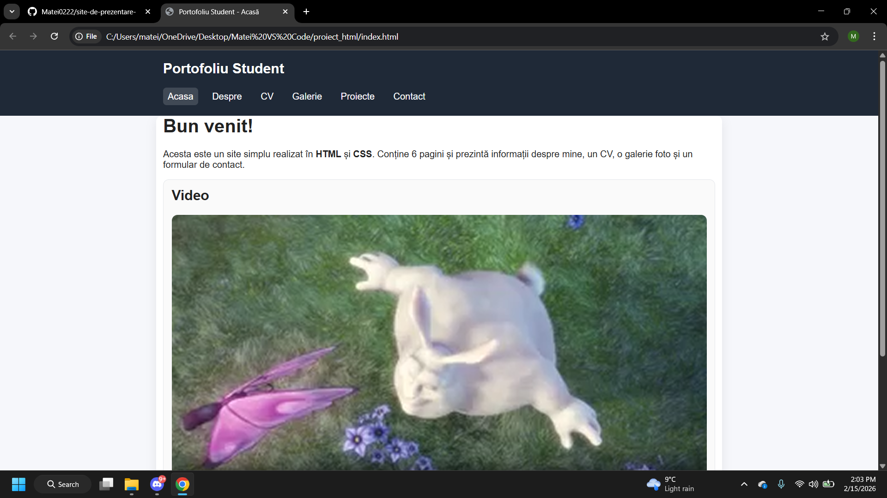

# Personal Portfolio Website – Static HTML/CSS Project

## Project Overview

This project represents a personal portfolio website developed entirely using core front-end technologies: **HTML5** and **CSS3**. The site is structured into six distinct sections, each carefully designed to demonstrate best practices in content organization and user interface (UI) styling.

The main objective of this project was to create a digital portfolio that effectively combines functionality with a clean, professional design, ensuring intuitive navigation across all pages.

---

## Project Structure

The website consists of the following pages:

1. **Home (index.html):**
   The main entry point of the website, featuring a brief introduction, embedded multimedia content (video), and relevant external resources.

2. **About (despre.html):**
   A biographical section that uses grid-based layouts to present personal interests, along with an embedded interactive map (Google Maps via iframe).

3. **CV (cv.html):**
   A structured presentation of academic background and technical skills, organized in a clear and easy-to-read format.

4. **Gallery (galerie.html):**
   A photo album demonstrating image handling techniques and alignment within a modern layout.

5. **Projects (proiecte.html):**
   A detailed overview of completed projects and resources used, including date input elements for better organization.

6. **Contact (contact.html):**
   A comprehensive contact form incorporating multiple input types and validation fields, including text, email, phone number, dropdown selection, radio buttons, checkboxes, file upload, and a time picker.

---

## Key Strengths & Technical Skills Demonstrated

* **Semantic HTML5:**
  Proper use of structural tags (`header`, `nav`, `main`, `section`, `footer`) to improve accessibility, maintainability, and search engine indexing.

* **Modern CSS Techniques:**
  Implementation of the Box Model, Flexbox, and CSS Grid to create flexible layouts and ensure precise element alignment.

* **Forms & Interactivity:**
  Development of a fully functional front-end contact form capable of handling various data formats and file attachments.

* **Media Integration:**
  Integration of native video content and iframe-based maps, showcasing versatility in managing external resources.

* **UX/UI Design Principles:**
  Use of a balanced color palette, consistent spacing, and hover effects to deliver a smooth and professional user experience.

---

## Technical Specifications

* **Languages:** HTML5, CSS3
* **Styling:** External CSS file (`style.css`) to maintain a clear separation between structure and presentation
* **Responsiveness:** Layout built using percentage-based dimensions and flexible units to ensure adaptability across different screen resolutions

---

## Visual Presentation (Screenshots)
This section includes screenshots of each page to illustrate the visual design of the project:

### Home Page

## About Me Page

## Curriculum Vitae (CV)

### Photo Gallery

### Projects & Resources

### Contact Form

 ## How to Use
  To view the project locally:
1. Clone this repository.
2. Open the index.html file in any modern web browser.
